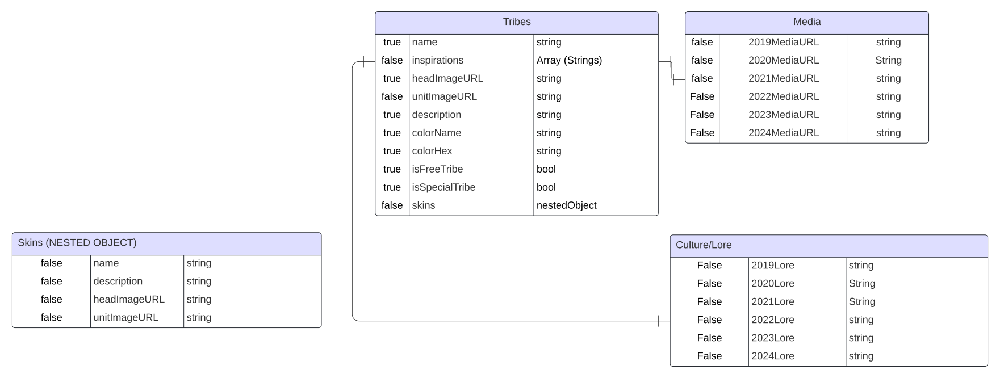

Since 2016 a unique little game (Which shall not be named (Just kidding I think they allow that)) helped me pass time and find joy in pretty awful parts of my life

My goal for this project: A website that shows off the various tribes of Polytopia (Owned and developed by Midjiwan) through the use of an API that I created for the use of this personal project. Displaying their lore and various facts about their culture outlined in Midjiwan's monthly "Tribe Moon" celebrations.

Backend ERD:

Ideal frontend design

ideal mobile design

Many of my stretch goals involve intelligent use of the data in my API. Including
*   Sorting by paid tribes/special tribes
*   Actually getting the Youtube Player to work
*   Toggling between tribe skins
*   Randomizing lore tidbits, accompanied by images
*   A fourth "Strategies" model, where users can add to for each tribe via Axios.PUT