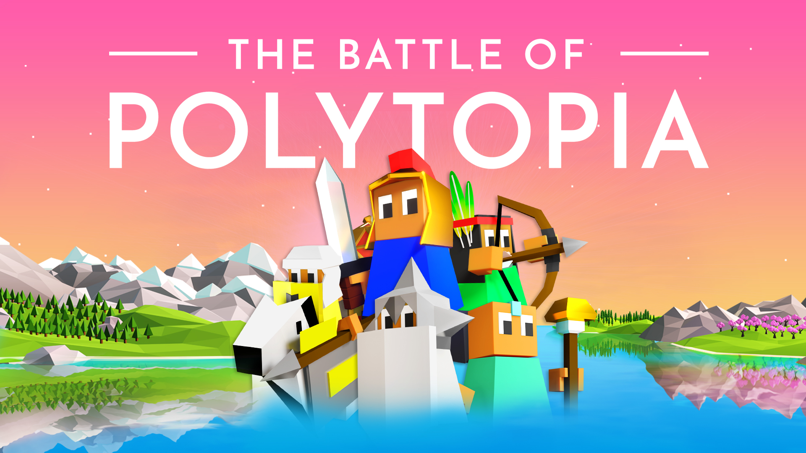
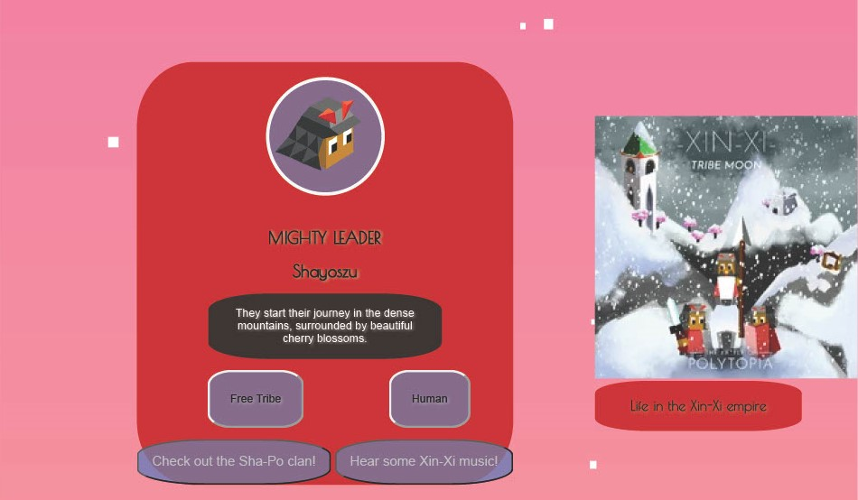
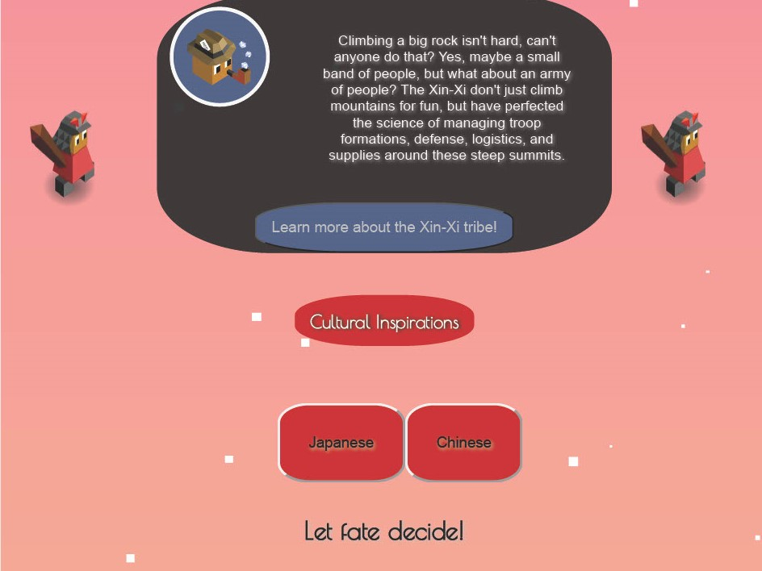

Full Stack MEN stack project  (Mongoose Express Node) by Jordan Johnson-Carter

Since 2016 a unique little game ~~(Which shall not be named)~~ (Just kidding, they allow that) helped me pass time and find joy in pretty awful parts of my life.

That game, ***The Battle of Polytopia*** (Owned and developed by Midjiwan AB), is the focus of this project. Learn more about the game's various tribes featured in the game, their cultures, clans, music, and other fun tidbits as outlined by Midjiwan's celebratory "Tribe Moon" posts.

All the data is populated via an API created by yours truly.

 

In addition to this, if you have a MongoDB account, you can download this repo and simply replace my (Hidden) connection string with your own to run and play around with the website yourself! With a copy of the website's current database as of October 24th of 2024. 

But don't take credit for it, seriously.

## Credits

Background - Polytopia iOS app (Screenshot off of my phone)

Tribe heads and units - [Midjiwan's Game Assets](https://polytopia.io/game-graphics/)

Tribe Moon images and text - Midjiwan AB's social media posts

Pipeman - [Midjiwan's Game Assets](https://polytopia.io/game-graphics/)

 (Spiffy)

(Polytopia is owned by Midjiwan AB, this is an UNNOFICIAL fan website)